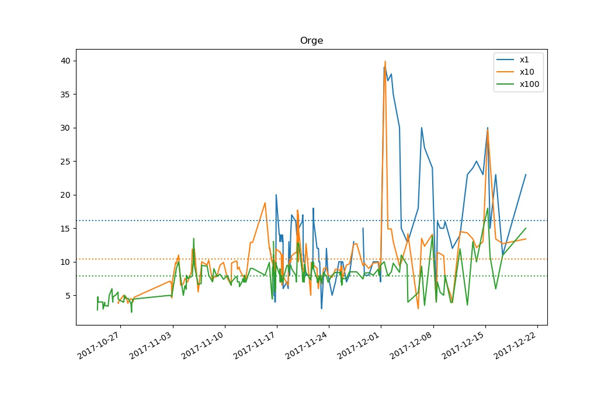

# Prices analysis in Dofus

This is a personal project conducted over two months, powered by a price-retrieving bot I made for the online MMORPG Dofus.
I used this bot to create a database of prices for 44 items, collected at 929 times in total.

The database is stored in prices.hdf5 as a pandas DataFrame and looks like this:

|       Items         | Blé | Blé  | Blé   | Orge | Orge  | Orge   | Avoine | Avoine | Avoine |  ...   |
|---------------------|-----|------|-------|------|-------|--------|--------|--------|--------|--------|
|    Quantities       | x1  | x10  | x100  | x1   | x10   | x100   | x1     | x10    | x100   |  ...   |
| 2017-12-15 08:11:35 | 5.0 | 37.0 | 449.0 | 30.0 | 297.0 | 1798.0 | 50.0   | 97.0   | 737.0  |  ...   |
| 2017-12-15 15:50:42 | 5.0 | 44.0 | 548.0 | 15.0 | 249.0 | 1080.0 | 47.0   | 39.0   | 399.0  |  ...   |
| 2017-12-16 10:03:25 | 4.0 | 50.0 | 599.0 | 23.0 | 134.0 | 595.0  | 47.0   | 33.0   | 193.0  |  ...   |
| 2017-12-17 08:23:51 | 7.0 | 70.0 | 539.0 | 11.0 | 127.0 | 1095.0 | 33.0   | 70.0   | 345.0  |  ...   |
| 2017-12-20 11:00:19 | 3.0 | 59.0 | 511.0 | 23.0 | 134.0 | 1500.0 | 3.0    | 19.0   | 143.0  |  ...   |

Notice that the items' names are all in French, as this is the language I play the game in.

The columns index is a MultiIndex, with the first level being the item and the second being the quantity. Each item can be sold in packs of 1, 10 or 100 at the choice of the seller and the prices for the 3 quantities are independent, although obviously strongly linked because of the obvious arbitrage opportunity a difference between them represents.

pricesanalysis.py is the file where all of my data analysis function for this database are coded. Here is a quick use guide for the most useful among them.
## disptails
```python
disptails(size=10, withmeans=True, items=headers, database=prices)
```
Displays, for each item in `items`, its last `size` prices and its average unit price in `database`.

## curve
```python
curve(items, freq='', aligned=True, database=prices, withmeans=True)
```
Plots the prices of `items` (list of items or single item) through time. `aligned` means that all prices will be in price per unit. `freq` allows you to resample the database first for smoothing purposes. By default, the three means will also be shown on the graph.

## dashboard
```python
dashboard(withgraphs=False, freq='', alphasort=False, database=prices)
```
Displays information about what prices have changed by more than 30% between the latest two measurements, with the option of resampling the prices first. For instance, `dashboard(freq='D')` would first resample `prices` by day and then show you what items have had their prices change by more than 30% between the last two days of measurement.

I never use `alphasort` as I am very familiar with the default ordering (based on the bot's path through trading posts) but some people might find it more practical.

## dispalignment / quickdispalignment
```python
dispalignment(item, bulk=2, database=prices, show=True)
quickdispalignment(item)
```
These two give you info on an item's _alignment_ through time.
### What is alignment?
Consider the following graph, given by using `curve('Orge')`:


### Usage

## study
```python
study(items)
```
