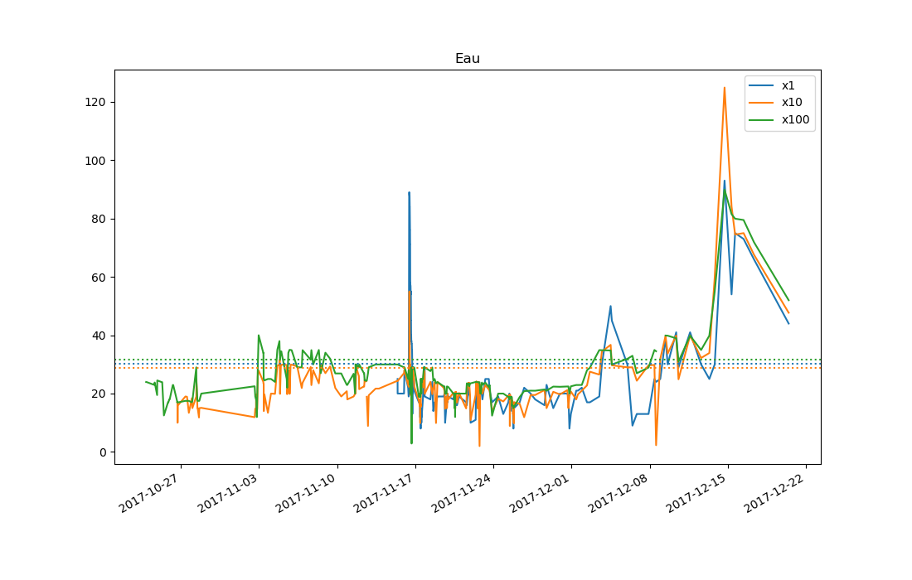

# Prices analysis in Dofus

This is a personal project conducted over two months, powered by a price-retrieving bot I made for the MMORPG Dofus.
I used this bot to create a database of prices for 44 items, collected at 929 points in time, with the goal of using the advantage of superior information to make high profits by buying and selling on the various public trading posts of the game.

The database is stored in `prices.hdf5` as a pandas DataFrame and looks like this:

|       Items         | Blé | Blé  | Blé   | Orge | Orge  | Orge   | Avoine | Avoine | Avoine |  ...   |
|---------------------|-----|------|-------|------|-------|--------|--------|--------|--------|--------|
|    Quantities       | x1  | x10  | x100  | x1   | x10   | x100   | x1     | x10    | x100   |  ...   |
|        ...          | ... |  ... |  ...  |  ... |  ...  |  ...   |  ...   |  ...   |  ...   |  ...   |
| 2017-12-15 08:11:35 | 5.0 | 37.0 | 449.0 | 30.0 | 297.0 | 1798.0 | 50.0   | 97.0   | 737.0  |  ...   |
| 2017-12-15 15:50:42 | 5.0 | 44.0 | 548.0 | 15.0 | 249.0 | 1080.0 | 47.0   | 39.0   | 399.0  |  ...   |
| 2017-12-16 10:03:25 | 4.0 | 50.0 | 599.0 | 23.0 | 134.0 | 595.0  | 47.0   | 33.0   | 193.0  |  ...   |
| 2017-12-17 08:23:51 | 7.0 | 70.0 | 539.0 | 11.0 | 127.0 | 1095.0 | 33.0   | 70.0   | 345.0  |  ...   |
| 2017-12-20 11:00:19 | 3.0 | 59.0 | 511.0 | 23.0 | 134.0 | 1500.0 | 3.0    | 19.0   | 143.0  |  ...   |

The items' names are in French, as this is the language I play the game in.

The columns index is a `MultiIndex`, with the first level being the item and the second being the quantity. Each item can be sold in packs of 1, 10 or 100 at the choice of the seller and the prices for the 3 quantities are independent, although obviously linked because of the arbitrage opportunity a difference between them represents.

`pricesanalysis.py` is the file where all of my data analysis functions for this database are coded. Here is a quick use guide for the most useful among them.
## disptails
```python
disptails(size=10, withmeans=True, items=headers, database=prices)
```
Displays, for each item in `items`, its last `size` prices and its average unit price in `database`.

## curve
```python
curve(items, freq='', aligned=True, database=prices, withmeans=True)
```
Plots the prices of `items` (list of items or single item) through time. `aligned` means that all prices will be in price per unit. `freq` allows you to resample the database first for smoothing purposes. By default, the three means will also be shown on the graph.

## dashboard
```python
dashboard(withgraphs=False, freq='', alphasort=False, database=prices)
```
Displays information about what prices have changed by more than 30% between the latest two measurements, with the option of resampling the prices first. For instance, `dashboard(freq='D')` would first resample `prices` by day and then show you what items have had their prices change by more than 30% between the last two days of measurement.

I never use `alphasort` as I am very familiar with the default ordering (based on the bot's path through trading posts) but some people might find it more practical.

## dispalignment
```python
dispalignment(item)
```
This gives info on an item's _alignment_ through time.

### What is alignment?
Consider the following graph, given by using `curve('Orge')`:

You may notice that the lower quantities are sold for a consistently higher price than the higher quantities. The reason for that is the high cost of selling Orge (barley) in low quantities, in terms of time and trading post slots. This is an item that sellers have in high quantities (they harvest hundreds of units before selling them), but that buyers sometimes want in low quantities.

This graph, given by using `curve('Eau')`, shows the (more common) opposite case:

In this case, since Eau (water) can only be harvested in small quantities at wells, most sellers only have them in small quantities. On the other hand, water is necessary for many potion recipes, which means that alchemists buy water in very large quantities. This produces the opposite effect from Orge, where the higher quantities are consistently more expensive than the lower ones.

To quantify this phenomenon, we use a number I call alignment. Each item has two alignment values (processed after getting all prices down to a per-unit basis):
- Alignment 1 (x10 price / x1 price)
- Alignment 2 (x100 price / x10 price)

If there were no costs of transaction such as time and limited item slots, all items would presumably have both alignments very close to 1. In reality, items like Orge have _low alignment_ (i.e. less than 1) while items like Eau have _high alignment_ (more than 1).

Studying an item's alignment allows one to make very safe profitable transactions. Knowing the alignment's stability (with data like the probability of being greater than 1 and the standard deviation of the alignment which are given by functions in the code) is especially helpful in planning large-scale alignment-based investments.

### Usage
`dispalignment` gives detailed info on on both alignments of an item, and shows a plot of the alignments across time.
One useful detail it gives is the percentage of the time they are above 1, which is a good indicator of the consistency of the alignment.

For instance, Eau has an A2 average of 1.33 and its A2 is greater than 1 about 89% of the time.

## study
```python
study(items)
```
Shows various useful pieces of information about `items`, such as recent prices on different timescales and alignment information.

## Everyday use

To use this program effectively, my daily workflow while the project was on consisted of two phases:
* Short-term investments
  - Make a measurement of all prices with the bot.
  - Use `dashboard` to find any immediate profit opportunities.
* Long-term investments
  - Based on the output of `dashboard` and a quick `disptails` or `multitails`, select a few items which look promising.
  - Study them with `study` and `dispalignment` to decide whether to invest and how.
